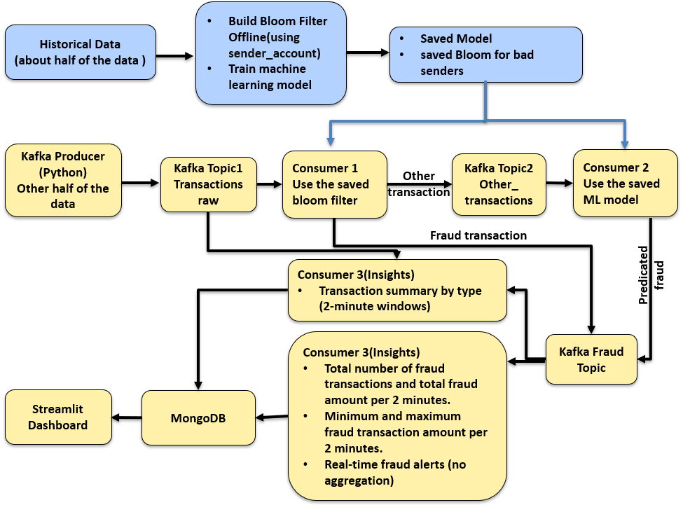

# Real-Time Fraud Detection Pipeline using Kafka, Spark Streaming, and Machine Learning

## Overview

This project implements a real-time fraud detection system for financial transactions using Apache Kafka, Apache Spark Streaming, Bloom Filters, Machine Learning, MongoDB, and Streamlit.

The system combines offline model training with online stream processing to identify potentially fraudulent transactions in real time. Historical transaction data is used to build a Bloom Filter and train a fraud detection model, while incoming transactions are continuously streamed through Kafka and analyzed by Spark Streaming components.

---

## System Architecture

The following diagram illustrates the complete offline and online fraud detection pipeline.



---

## Project Workflow

### Offline Phase

* Perform exploratory data analysis (EDA).
* Build a Bloom Filter using known fraudulent sender accounts.
* Train a Machine Learning fraud detection model.
* Save the trained model and Bloom Filter for online deployment.

### Online Phase

1. A Kafka Producer streams transaction records in real time.
2. Consumer 1 applies the Bloom Filter to detect known suspicious senders.
3. Non-suspicious transactions are forwarded to a second Kafka topic.
4. Consumer 2 applies the trained Machine Learning model.
5. Predicted fraudulent transactions are sent to a dedicated Kafka fraud topic.
6. Consumer 3 generates real-time insights and alerts.
7. Results are stored in MongoDB.
8. A Streamlit dashboard visualizes fraud statistics and alerts.

---

## Technologies Used

* Apache Kafka
* Apache Spark Streaming
* Scala
* Python
* MongoDB
* Streamlit
* Bloom Filter
* Machine Learning

---

## Repository Structure

```text
01_data_exploration_and_kafka_producer.ipynb
02_offline_model_training.scala
03_kafka_spark_streaming_pipeline.scala
04_streamlit_fraud_dashboard.py
```

---

## Features

* Real-time transaction processing
* Fraud detection using Machine Learning
* Bloom Filter optimization for known fraudulent senders
* Kafka-based streaming architecture
* Spark Streaming analytics
* MongoDB integration
* Interactive Streamlit dashboard
* Real-time fraud alerts and monitoring

---

## Future Improvements

* Deploy the pipeline on a distributed cluster.
* Add advanced anomaly detection techniques.
* Integrate deep learning models for fraud prediction.
* Support larger-scale transaction streams.

---

## Author

**Mariam Shehada**

M.Sc. Student in Artificial Intelligence

An-Najah National University
